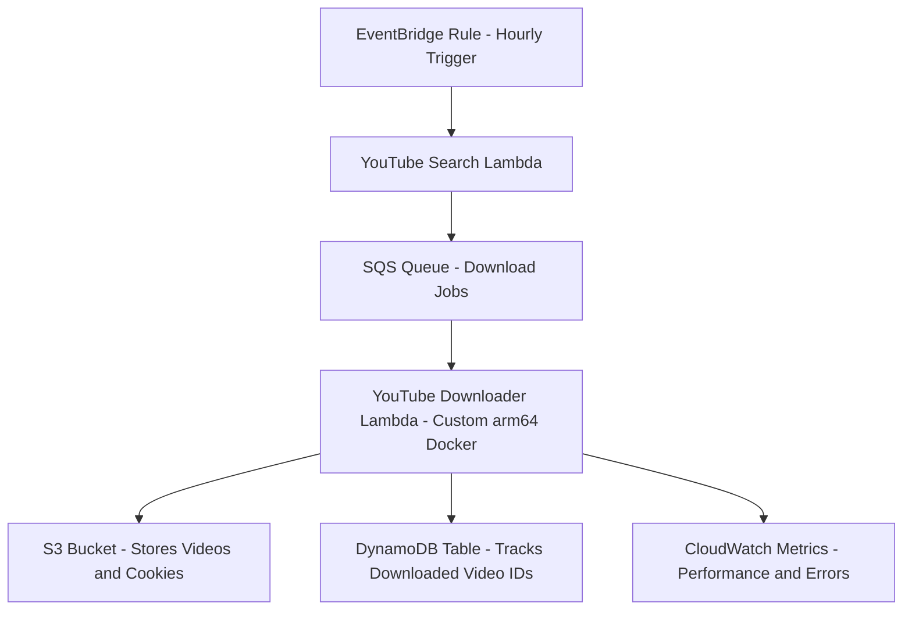

# Serverless YouTube File Sync

This is a high-performance, serverless application built on AWS that automates downloading YouTube videos. It runs on an hourly schedule, finds new videos based on a defined search query, saves them to S3, and tracks downloaded videos in DynamoDB to prevent duplicates.

The entire infrastructure is defined with the AWS CDK and deployed as a custom `arm64` Docker container, providing cost-effective and powerful execution.

## Solution Architecture

The application uses a decoupled, event-driven architecture:



**Workflow Description:**

1.  **Schedule:** An **Amazon EventBridge Rule** triggers the process hourly.
2.  **Search:** The rule invokes the `youtube-search` Lambda. This function queries the YouTube v3 API and enqueues new video IDs into an SQS queue.
3.  **Queue:** An **Amazon SQS Queue** receives the download jobs, decoupling the search logic from the heavy-lifting download process.
4.  **Download:** The SQS queue triggers the `youtube-downloader` Lambda. This function runs on a custom **`arm64` Docker image** containing static builds of `ffmpeg` and `yt-dlp`.
5.  **Process:**

    - Each download job is received from the SQS queue, which is automatically retried up to 3 times before being sent to a Dead Letter Queue (DLQ) for inspection.

    - The downloader first validates required environment variables (e.g. BUCKET_NAME, TABLE_NAME, COOKIE_S3_KEY, COOKIE_MAX_AGE_HOURS) at startup to prevent misconfigurations.

    - It then checks DynamoDB to confirm the video hasn’t been processed already, ensuring idempotency.

    - A cookies.txt file is retrieved from S3 (and cached in /tmp) to authenticate YouTube requests and bypass rate limits.

    - The downloader invokes yt-dlp with multiple --extractor-args and player_client fallbacks (web, ios, etc.) for robust handling of YouTube’s protection mechanisms.

    - The video is downloaded to the Lambda’s /tmp directory, then uploaded to S3 in the designated bucket path (videos/...).

    - Upon success, the video metadata is stored in DynamoDB, and CloudWatch metrics are recorded (VideosDownloaded, DownloadDuration, DownloadFailures) to monitor performance and error rates.

    - Lifecycle rules on the S3 bucket automatically delete all uploaded videos after 24 hours to control storage costs.

6.  **Track:** A new item is written to the **DynamoDB table** to mark the video as complete.

## Key Features

- **High-Performance `arm64` Runtime:** Runs on AWS Graviton processors (`arm64`) for better performance and lower cost.
- **Custom Docker Runtime:** Uses a custom `Dockerfile` with a `nodejs:20-arm64` base, with static `ffmpeg` and `yt-dlp` binaries built-in for maximum reliability.
- **Resilient Download Logic**: Automatically retries failed downloads and cycles through multiple YouTube player_client modes (ios, web, etc.) to bypass client-specific restrictions.
- **Cookie Management:** Securely fetches a `cookies.txt` file from S3, enabling downloads of private or members-only content.
- **Intelligent Caching:** Cookies are cached in the Lambda's `/tmp` directory with a TTL (`COOKIE_MAX_AGE_HOURS`) to minimize S3 `GetObject` calls.
- **Stateful Processing:** A DynamoDB table tracks all downloaded `videoId`s, making the entire process idempotent and preventing duplicate work.
- **Fully Decoupled:** SQS isolates the search and download logic, allowing failures and retries without data loss.
- **Infrastructure as Code:** The entire stack (Lambdas, S3, DynamoDB, SQS, IAM Roles) is defined in a single AWS CDK file.

## Tech Stack

- **Infrastructure as Code:** AWS CDK v2 (TypeScript)
- **Cloud Services:**
  - AWS Lambda
  - Amazon S3 (for video storage and cookie hosting)
  - Amazon DynamoDB (for state management)
  - Amazon SQS (for job queueing)
  - Amazon EventBridge (for scheduling)
  - AWS IAM
- **Lambda Runtimes:**
  - **YoutubeSearchFunction** – Runs on `Node.js 20.x` managed runtime.
  - **YoutubeDownloaderFunction** – Runs on a custom Docker image based on `public.ecr.aws/lambda/nodejs:20-arm64`, optimized for performance and ARM cost efficiency.
- **Key Binaries (in Docker):** `Python 3.11`, `yt-dlp` (static), `ffmpeg` (static)
- **Key NPM Packages:** `aws-cdk-lib`, `@aws-sdk/v3`, `googleapis`, `esbuild`

## Project Structure

```

.
.
├── bin/
│ └── youtube-file-sync.ts # CDK app entry point (initializes the stack)
│
├── lib/
│ └── youtube-file-sync-stack.ts # Main AWS CDK stack (defines all AWS resources)
│
├── lambda/
│ ├── youtube-search.ts # Lambda: Searches YouTube & enqueues new video jobs (SQS)
│ ├── youtube-downloader.ts # Lambda: Downloads videos, uploads to S3, logs to DynamoDB
│ └── utils/
│ ├── validate-env.ts # Ensures required environment variables are set
│
├── test/ # Jest tests for CDK and Lambda logic
│
├── Dockerfile # Builds the custom ARM64 image for the downloader Lambda
├── cdk.json # CDK project configuration
├── jest.config.js # Jest test configuration
├── package.json # Project dependencies and scripts
├── tsconfig.json # TypeScript compiler configuration
├── .dockerignore # Excludes unnecessary files from Docker build context
└── .gitignore # Excludes build and dependency artifacts from version control

```

## Setup and Deployment

### 1. AWS Pre-Deployment Steps

Before deploying, you may need to set up the following resources in your AWS account.

1.  **Upload Cookie File:**

    - Sign in to YouTube in your browser (Chrome or Firefox) using the account you want.

    - Install a trusted browser extension that can export cookies in Netscape cookies.txt format (search the web store for “export cookies to cookies.txt”).

    - Use the extension to export cookies for youtube.com (optionally include .youtube.com and .google.com).

    - Verify that the file contains lines of 7 tab-separated fields, for example:
      `.youtube.com    TRUE    /    FALSE    1700000000    SID    <value>`

2.  **Upload to S3:**
    - Go to the **Amazon S3** console.
    - Create the bucket `youtube-file-sync-videos-bucket`. (The stack will adopt this, or you can let the stack create it first and then upload).
    - Upload your `cookies.txt` file to the following path:
      `s3://youtube-file-sync-videos-bucket/secrets/cookies.txt`

### 2. Deployment Steps

1.  **Clone & Install:**

    ```sh
    git clone https://github.com/Abdulhaleem-6/youtube-file-sync.git
    cd youtube-file-sync
    npm install
    ```

2.  **Set Deploy-Time Variables:**
    Your stack reads environment variables on deployment for the `Youtube` Lambda. Create a `.env` file or export them in your shell:

    ```ini
    # .env
    SEARCH_QUERY="your search query"
    YOUTUBE_API_KEY="your-api-key-here"
    ```

3.  **Bootstrap CDK:**
    You must bootstrap your AWS environment to support `arm64` Docker builds.

    ```sh
    # Replace with your AWS Account ID and Region
    cdk bootstrap aws://<ACCOUNT-ID>/<REGION>
    ```

4.  **Deploy:**
    ```sh
    cdk deploy
    ```

The CDK will now build your TypeScript, create the Docker image, push it to your private ECR, and deploy all the AWS resources.

### Example End-to-End Flow

1. **EventBridge** triggers the `youtube-search` Lambda hourly.
2. The Lambda queries YouTube and sends new video IDs to **SQS**.
3. The SQS queue invokes the `youtube-downloader`.
4. The downloader fetches cookies, downloads the video, uploads it to **S3**, and logs it in **DynamoDB**.

```

```
